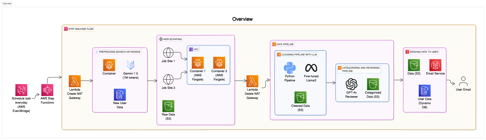
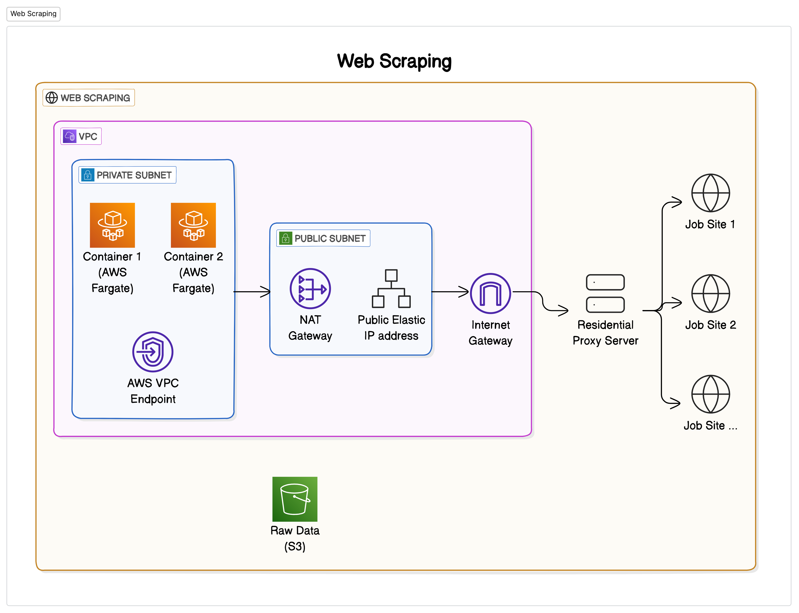
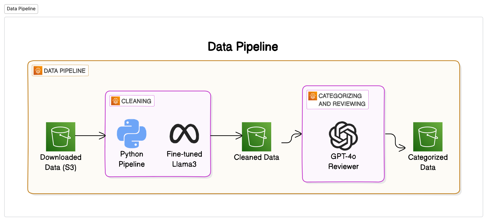

    
    
<a target="_blank" href="https://jobsdreamer.com">JobsDreamer</a>

    
All internships on the internet in last 24 hours to your email

## Technical Report

- The software collects scraped data from the internet and processes it to provide a list of internships to the user. The code is closed source.

### Overview

    

### Web Scraping

    

### Data Processing Pipeline

    

